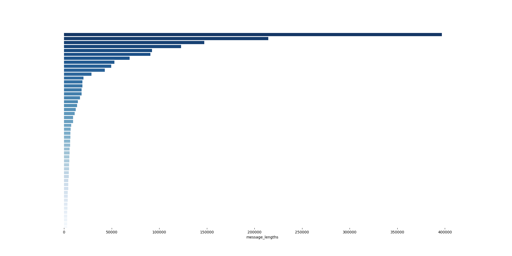
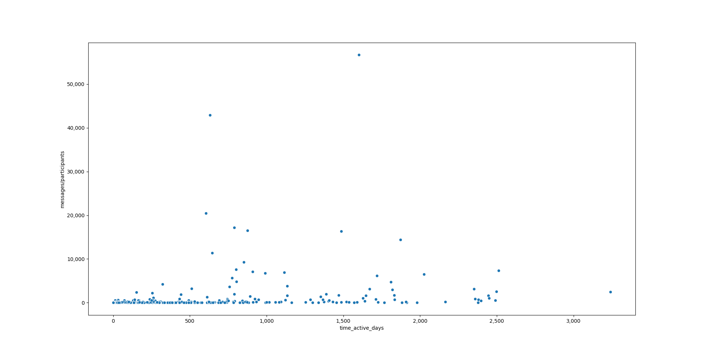
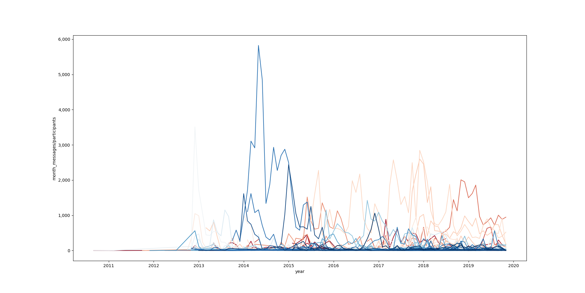
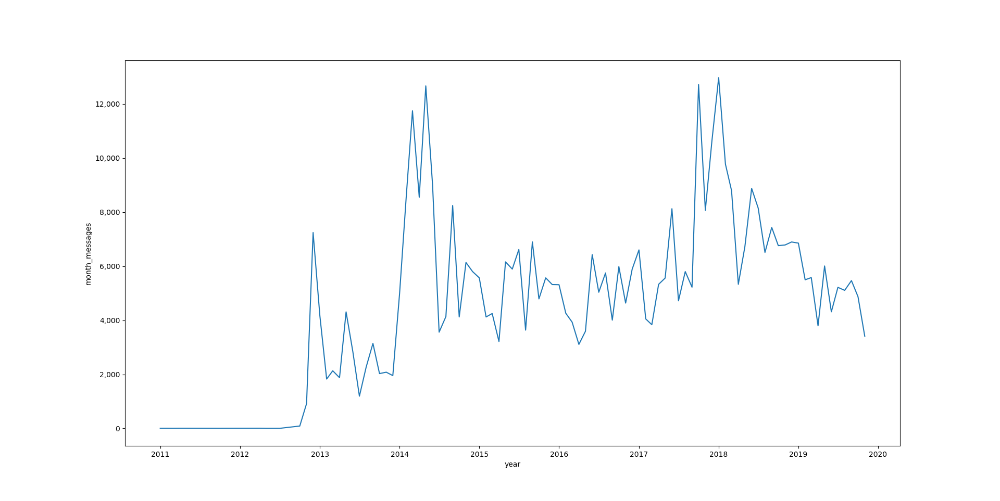
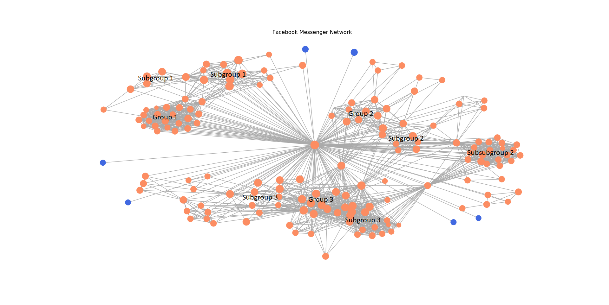
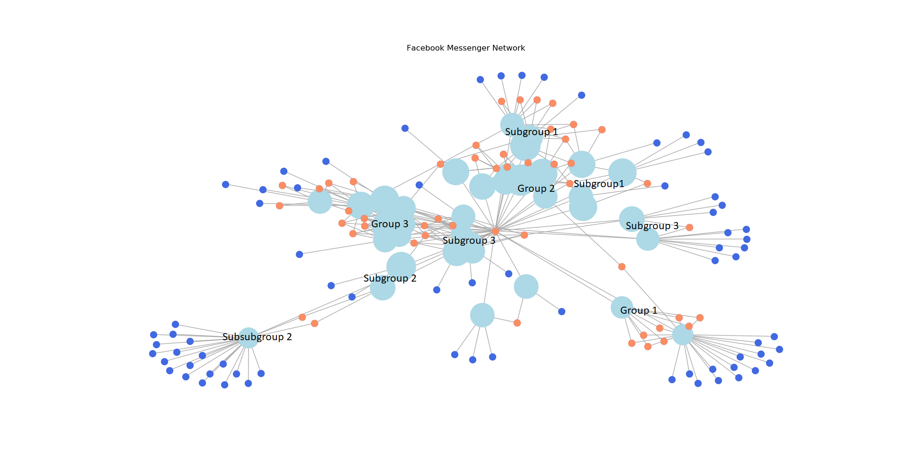

# facebook-messenger-parser
A data parser to extract insights from Facebook Messenger data
[downloaded from Facebook](https://www.facebook.com/settings?tab=your_facebook_information) in JSON format.

## Results
### Exploratory Plots
Due to Messenger being part of a social network, preferential attachment (in this case
the sending of messages) is expected, and we do indeed see a few chats with the majority of the sent messages.

<p align="left">
     
</p>

The number of messages in a chat doesn't appear to correlate with active time (the time between the first and last 
messages in a chat), which is expected to an extent as the closeness of the relationship should be a much stronger factor (*left*). 
However, taking a log-log view demonstrates that the chats with the most messages have been active for longer 
(as they have the more opportunity to send messages), but this can also be explained by the fact that the chats which don't die out
will tend to involve closer friends (*right*).

<p align="left">
     
     
</p>

The number of messages by year shows that the most active chat changes over time (*left*). The are also some interesting patterns 
in the number of own messages sent, with more sent around the new year and less just before summer (*right*).
For group chats the y-axis is normalised by the number of participants.

<p align="left">
     
     
</p>

### Network Plots
[Networkx](https://networkx.github.io/) is a fantastic Python package for anything network related.
To avoid overclustering the top 100 message participants (*left*) and top 50 group chats (*right*) and are plotted in 
spring layout to group connected nodes, with clear groups and subgroups forming. The size of each node is weighted by log(number of messages).

Plotting by group chat tends to group by mutual chat participants whereas plotting the participants individually enables 
clearer mutual friend groups to form. 
This becomes much more interesting with knowledge of your own friend circles and annotate_plots=True to give the data
more context.

<p align="left">
     
     
</p>

## Getting Started
- Save the Messenger data folder for each chat to a 'messages' folder in the same folder as this module
- If the Messenger data files are entitled 'message.json' instead of 'message_x.json' where x is a number, this is the old Messenger data format. 
At the bottom of [main.py](main.py) add split=False to the import_messenger_data('messages') function call
- Create a config.py file containing ```config = {'name': ''}```, this is used to plot the messages by year for a single name. 
Alternatively replace all instances of ```config['name']``` with the name to use
- Change the annotate_plots variable to True or False and run

## Development
- Exploration of Facebook Messenger data with both standard and network plots
- Examples of non-annotated graphs are available in the [graphs_nolabel](graphs_nolabel) folder, 
annotated plots are much more intriguing but are withheld due to PII
