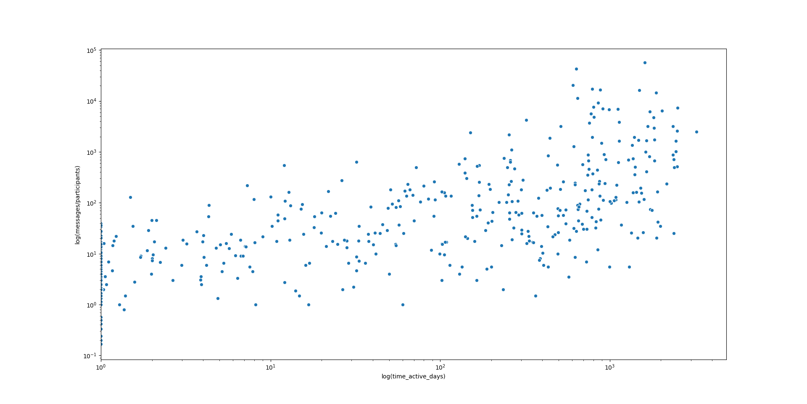

# facebook-messenger-parser
A data parser to extract insights from Facebook Messenger data.
This exploration is conducted on the Messenger data 
[downloaded from Facebook](https://www.facebook.com/settings?tab=your_facebook_information) in JSON format.

## Results
### Exploratory Plots
Sort the data and take the 50 chats with the most messages.

     

The number of messages in a chat doesn't appear to correlate with active time (time between the first and last messages 
in the chat), which is expected to an extent since the closeness of the relationship will be a much stronger factor. 
However, taking a log-log view demonstrates that the chats with the most messages have been active for longer 
(have the opportunity for more messages), but this can also be explained by the fact that the chats which don't die out
will tend to involve closer friends.

     
     

The number of messages by year shows that the most active chat changes over time. The are also some interesting patterns 
in the number of own messages sent, with more sent around the new year and less just before summer.
For group chats the y-axis is normalised by the number of participants.

     
     

### Network Plots
[Networkx](https://networkx.github.io/) is a fantastic Python package for anything network related.
To avoid overclustering the top 50 group chats and top 100 message participants are plotted in spring layout to group 
connected nodes, and clear groups and subgroups form. The size of each node is weighted by log(number of messages).

Plotting the group chat tends to group by mutual participants whereas plotting the participants individually enables 
clearer mutual friend groups to form. 
This becomes much more interesting with annotate_plots=True and knowledge of your own friend circles to give the data
some context.

     
     

## Getting Started
- Save your Messenger data to a 'messages' folder in the same folder as this module
- If your Messenger data files are entitled 'message.json', at the bottom of [main.py](main.py) 
add split=False to import_messenger_data('messages') as this is the old Messenger data format
- Change the annotate_plots variable to True or False

## Development
- Exploratory work of Facebook Messenger data with both standard and network plots
- Examples of non-annotated graphs are available in the ['graphs_nolabel' folder](\graphs_nolabel), 
annotated plots are much more intriguing but are withheld due to PII
